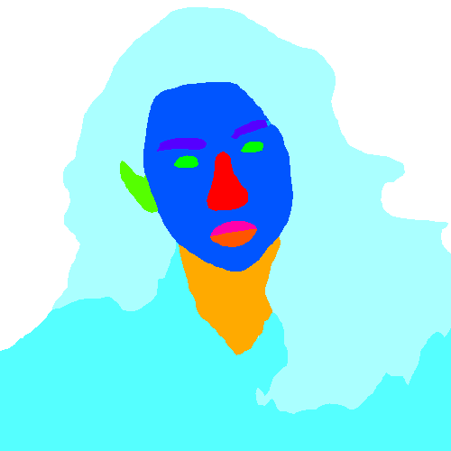
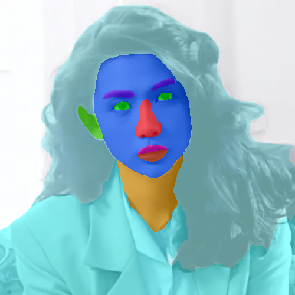

# Face Parsing
# 1. 模型
使用模型以及部分数据处理：[face-makeup](https://github.com/zllrunning/face-makeup.PyTorch) 
将模型放于FaceParsing/checkpoints/目录下，torch和onnx模型:[百度云](https://pan.baidu.com/s/1MgPKsW8xYR1y5nqy4ccEuw)
**提取码：xyca** 
重新训练模型，请查看[face-makeup](https://github.com/zllrunning/face-makeup.PyTorch) 
本文使用上述模型进行人脸解析测试(对人脸各个部位上色，上口红)，包括单张图片和实时视频的测试, 结果如下图。

 

# 2. 环境配置
1. 在win10 + torch1.8.0 + python3.6环境下测试
2. 安装依赖: pip install -r requirements.txt

# 3. 代码说明
1. torch2onnx.py -- 将模型转为onnx模型
    python torch2onnx.py
    - 将在原模型下导出相同名称的onnx模型
 

2. test_image.py -- 图片级别的测试
    python test_image.py --device 'cpu' --mode 0 --path [your_img_path] --use_onnx False
    - device: 使用cpu或cuda，默认cpu
    - mode: 测试模式 0为上色; 1为上色后与原图叠加显示; 2为上口红， 默认0
    - path: 输入图片的路径, 同时也是结果图片的输出目录
    - use_onnx: 是否使用onnx模型，默认False
    - 使用方式：在输入图片的路径下产生口红图：
    python --mode 2 --path [your_img_path]
     

3. test_video.py -- 实时视频，调用摄像头检测
    python test_video.py --device 'cpu' --mode 0 --use_onnx False
    - device: 使用cpu或cuda，默认cpu
    - mode: 测试模式 0为上色; 1为上色后与原图叠加显示; 2为上口红， 默认0
    - use_onnx: 是否使用onnx模型，默认False
 

4. 转模型推理(仅计算推理时间，不包括数据处理)时间粗略对比:

    - 图片级别对比, CPU-i表示使用CPU测试i张图片的时间
        ||torch|onnx|   
        |-|-|-|         
        |CPU-1|260-280 ms|80-100 ms|
        |CPU-1000|201582 ms|79436 ms|
        |GPU-1|1099 ms|658ms|
        |GPU-1000|9845 ms|15875 ms|
    - 视频实时帧数对比, video-mode-i-cpu表示使用cpu在模式i下测试的视频帧数
        ||torch|onnx|   
        |-|-|-|         
        |video-mode-1-gpu|12 fps|11 fps|
        |video-mode-1-cpu|4 fps|7 fps|
        |video-mode-2-gpu|5.5 fps ms|5.5 fps|
        |video-mode-2-cpu|3 fps|4.5 fps|

